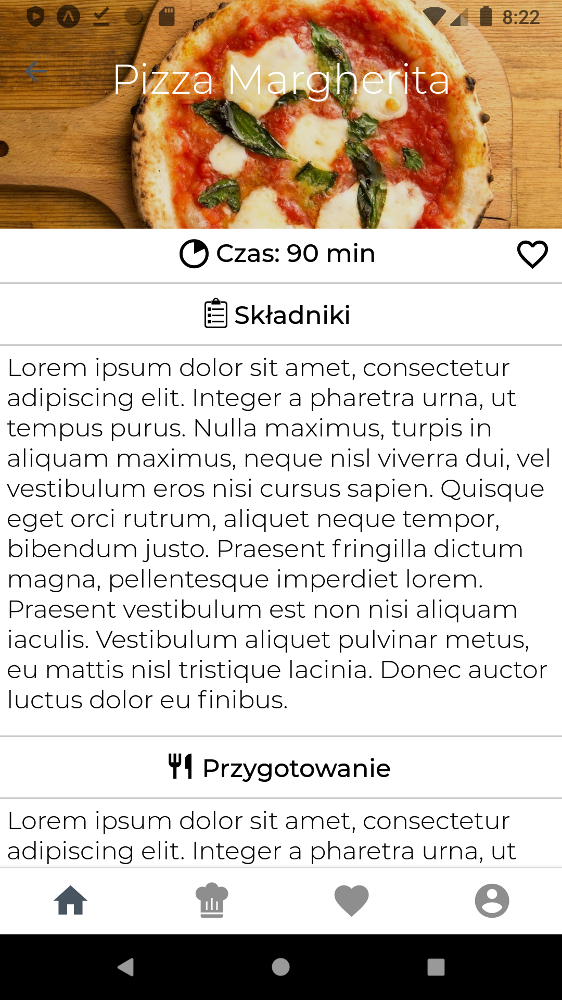

# Recipe-app
App with recipes added by users. 

## Table of contents
* [Built with](#Built-with)
* [Screenshots](#Screenshots)
* [Status](#status)

## Built with
* React-native
* Expo <i> 38.0.0 </i>
* Redux <i> 4.0.5 </i>
* Firebase <i> 7.9.0 </i>

## Screenshots
  
  
   

## Status
Project is in progress.

